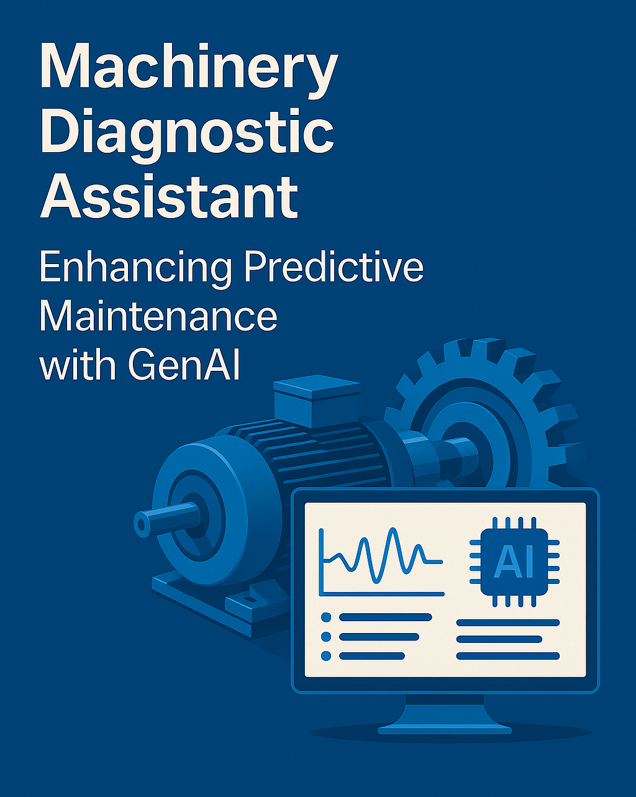

# Machinery Diagnostic Assistant with GenAI

This project was developed for the [5-Day Gen AI Intensive Course with Google](https://www.kaggle.com/learn-guide/5-day-genai), showcasing how Generative AI can enhance predictive maintenance for rotating equipment. Read more about it in my [Medium post](https://medium.com/@ali.dibaj93/machinery-diagnostic-assistant-enhancing-predictive-maintenance-with-genai-547ca9eddf8a).

